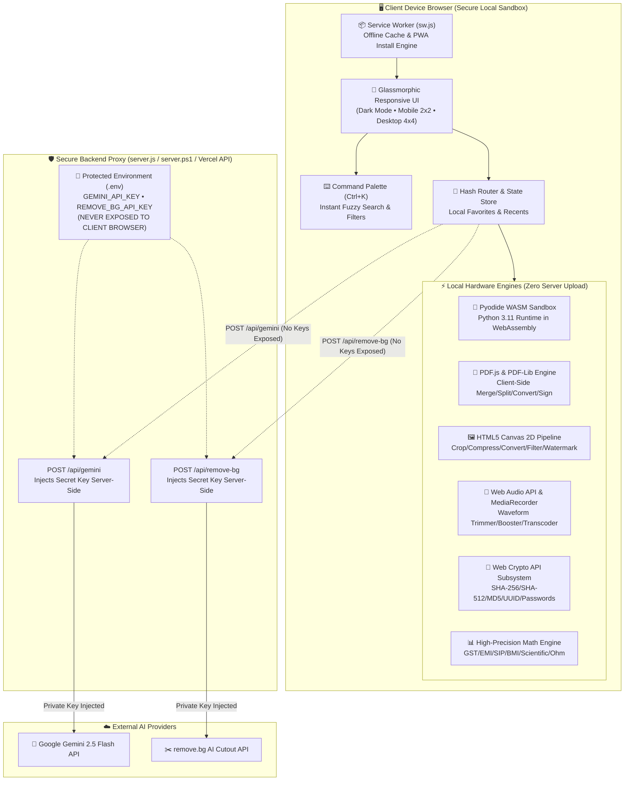

<div align="center">

```
 ▄████████    ▄████████    ▄████████ ▄██   ▄      ███        ▄██████▄   ▄██████▄   ███      
███    ███   ███    ███   ███    ███ ███   ██▄ ▀█████████▄   ███    ███ ███    ███ ███      
███    █▀    ███    ███   ███    █▀  ███▄▄▄███    ▀███▀▀██   ███    ███ ███    ███ ███      
███         ▄███▄▄▄▄██▀   ███        ▀▀▀▀▀▀███     ███   ██   ███    ███ ███    ███ ███      
███        ▀▀███▀▀▀▀▀   ▀███████████ ▄██   ███     ███   ██   ███    ███ ███    ███ ███      
███    █▄  ▀███████████          ███ ███   ███     ███   ██   ███    ███ ███    ███ ███      
███    ███   ███    ███    ▄█    ███ ███   ███     ███   ██   ███    ███ ███    ███ ███▌    ▄
████████▀    ███    ███  ▄████████▀   ▀█████▀     ▄████████▀   ▀██████▀   ▀██████▀  █████▄▄██
             ███    ███                                                                ▀    
```

# ⚡ EasyTool — The Next-Gen Private Utility Suite
### *68+ High-Performance Tools • 100% Client-Side Privacy • Zero Paywalls • Instant WASM Speed*

[](LICENSE)
[](#-complete-tool-studios--catalog)
[](#-security--privacy-architecture)
[](#-progressive-web-app-pwa)
[](#-creators--ownership-spotlight)

<br/>

> **"दिमाग फ़र्ज़ी • काम जुगाड़ • रिजल्ट ज़बरदस्त"**  
> *"Smart thinking, ingenious execution, uncompromising results."*

<br/>

[🚀 Live Demo](#-quick-start--local-setup) • [🧰 Explore 68+ Tools](#-complete-tool-studios--catalog) • [🛡️ Privacy Manifesto](#-security--privacy-architecture) • [⌨️ Keyboard Shortcuts](#️-power-user-shortcuts) • [👨‍💻 Creators](#-creators--ownership-spotlight)

</div>

---

## 🌟 Executive Overview

**EasyTool** is an ultra-fast, privacy-first web utility suite packing **68+ essential developer, multimedia, document, and fintech tools** into a single cohesive interface. 

Unlike conventional online utilities that upload your sensitive documents, PDFs, and media to remote servers, **EasyTool executes heavy computation directly inside your browser's memory** utilizing **WebAssembly (Pyodide Python 3)**, **HTML5 Canvas**, **Web Crypto API**, and **Web Audio API**.

```
╔═════════════════════════════════════════════════════════════════════════════════════════╗
║                                 THE EASYTOOL DIFFERENCE                                 ║
╠══════════════════════════════╦════════════════════════════╦═════════════════════════════╣
║ Feature                      ║ Standard Online Utilities  ║ EasyTool (Farzi Engineer)   ║
╠══════════════════════════════╬════════════════════════════╬═════════════════════════════╣
║ 📁 File Processing           ║ Uploaded to cloud servers  ║ 100% In-Browser RAM         ║
║ 🔒 Data Retention            ║ Unknown / 24-hr storage    ║ ZERO bytes stored anywhere  ║
║ ⚡ Execution Speed           ║ Network upload dependent   ║ Instant local CPU / GPU     ║
║ 💳 Pricing & Limits          ║ Daily caps & paywalls      ║ 100% Free Forever           ║
║ 🚫 Ads & Annoyances          ║ Intrusive banner spam      ║ Clean glassmorphism UI      ║
║ 📴 Offline Operation         ║ Fails without internet     ║ Full PWA offline cached     ║
╚══════════════════════════════╩════════════════════════════╩═════════════════════════════╝
```

---

## 📐 High-Level Visual Architecture



---

## 🧰 Complete Tool Studios & Catalog

EasyTool organizes its **68+ utilities** across **12 distinct specialized studios**:

```
┌────────────────────────────────────────────────────────────────────────────────────────┐
│                              EASYTOOL STUDIO DIRECTORY                                 │
├────────────────────┬──────────┬────────────────────────────────────────────────────────┤
│ Studio Name        │ Count    │ Key Functional Utilities Included                      │
├────────────────────┼──────────┼────────────────────────────────────────────────────────┤
│ 1. PDF Studio      │ 12 Tools │ PDF ↔ JPG/PNG, Merger, Splitter, Text OCR, Watermark   │
│ 2. Image Studio    │ 8 Tools  │ Converter (WEBP/PNG/JPG/SVG), Compressor, Cropper, FX  │
│ 3. Calculators     │ 9 Tools  │ GST Indian Tax, EMI Loan, SIP Wealth, BMI, Scientific  │
│ 4. Unit Converters │ 7 Tools  │ Metric/Imperial Universal Units, JSON ↔ CSV, TS types │
│ 5. Developer & Dev │ 7 Tools  │ Python 3 WASM Runner, Code Formatters, SQL Beautifier │
│ 6. AI Smart Suite  │ 6 Tools  │ AI Text Detector, Media Deepfake Checker, Gemini Chat  │
│ 7. Audio & Video   │ 4 Tools  │ MP4 to MP3 Extractor, Audio Trimmer, Volume Booster    │
│ 8. Business Studio │ 4 Tools  │ PDF Invoice Generator, Social Media Resizer, QR Lab    │
│ 9. Security Vault  │ 4 Tools  │ Hash Suite (SHA-256, SHA-512, MD5), UUID, Passwords    │
│ 10. Date & Time    │ 5 Tools  │ Live World Clocks, Stopwatch & Laps, Pomodoro Focus    │
│ 11. Text Studio    │ 6 Tools  │ Word Counter, Case Converter, Diff Checker, Cleaner    │
│ 12. Full Hub (68+) │ 68+ Hub  │ Studio Switcher, Global Fuzzy Search, Category Filter  │
└────────────────────┴──────────┴────────────────────────────────────────────────────────┘
```

### 1. 📄 PDF Studio (12 Tools)
* **PDF → JPG / PNG** — High-DPI page extraction with instant zip download.
* **JPG / PNG → PDF** — Multi-image photo compile into standardized PDF documents.
* **PDF Merger & Splitter** — Reorder, combine, or extract custom page intervals.
* **PDF Text Extractor** — Extract plain text, character tallies, and embedded metadata.
* **PDF Watermarker & Rotator** — Apply custom diagonal text watermarks and 90°/180° page rotations.
* **PDF Page Numberer** — Inject formatted header/footer page numbers client-side.

### 2. 🖼️ Image Studio (8 Tools)
* **Universal Image Converter** — Batch convert across JPG, PNG, WEBP, GIF, BMP, and SVG formats.
* **Smart Image Compressor** — Visual quality slider with real-time byte savings estimation.
* **Aspect Ratio Cropper** — Freeform and 16:9, 4:3, 1:1, 9:16 social presets.
* **Canvas Enhancer & Filters** — Real-time brightness, contrast, saturation, grayscale, and invert.
* **Base64 Encoder / Decoder** — Data URI generator with 1-click clipboard copy.
* **Precision Eyedropper & Color Picker** — HEX, RGB, HSL extraction from canvas photos.

### 3. 📊 Calculators Studio (9 Tools)
* **GST India Calculator** — Exclusive and inclusive tax breakdown for 5%, 12%, 18%, 28% slabs.
* **EMI Loan Planner** — Principal vs Interest visual progress bars, monthly dues, total amortization.
* **SIP Wealth Compounder** — Long-term wealth projection with return on investment calculations.
* **Age & Milestone Tracker** — Exact years, months, days, and next birthday countdown.
* **Health BMI Calculator** — Metric/Imperial body mass index with WHO health categories.
* **Scientific Calculator** — Trigonometric (sin/cos/tan), exponential, and logarithmic functions.
* **GPA & CGPA Calculator** — Multi-semester weighted credit score analyzer.
* **Ohm's Law Engine** — Voltage, Current, Resistance, and Electrical Power computations.

### 4. 🔄 Unit & Data Converters (7 Tools)
* **Universal Metric/Imperial Engine** — Length, mass, temperature, area, volume, and data bytes.
* **JSON ↔ CSV Transpiler** — Bidirectional parser with clean tabular previews.
* **JSON → TypeScript Interface Generator** — Instant TypeScript types from raw JSON payloads.
* **Color Space Converter** — Cross-convert between HEX, RGB, RGBA, and HSL palettes.

### 5. 💻 Developer & Code Tools (7 Tools)
* **Python 3.11 WASM Sandbox** — Full Python interpreter running via Pyodide WebAssembly in browser.
* **HTML / CSS / JS Beautifier** — Clean indentations, syntax normalization, and minification.
* **SQL Formatter** — Beautify complex SQL statements with capitalized keywords.
* **Regex Interactive Lab** — Live regular expression testing with matching group breakdowns.
* **Live Web Playground** — Interactive HTML/CSS/JS sandbox with instant iframe preview.

### 6. 🤖 AI & Smart Inspection Tools (6 Tools)
* **AI Text Detector** — Local heuristic entropy and token burstiness analysis to detect generated text.
* **AI Media Authenticity Inspector** — Forensic EXIF parsing, quantization artifacting, and chroma scan.
* **Gemini Prompt Studio** — Multi-persona AI assistant powered by Google Gemini API.
* **AI Document Summarizer** — Condense text into executive summaries and bullet points.
* **AI Tone Rewriter** — Paraphrase text into professional, casual, academic, or persuasive tones.
* **Magic Background Remover** — Fast cutout engine for product photos and portraits.

### 7. 🎵 Audio & Video Tools (4 Tools)
* **Video Frame Grabber** — Scruby video seek bar to capture frame-accurate PNG snapshots.
* **Video → MP3 Audio Extractor** — Extract lossless audio streams straight from MP4/WEBM.
* **Audio Waveform Trimmer** — Visual waveform zoom with millisecond-precision slice markers.
* **Volume Booster** — Audio gain staging up to 300% without digital clipping.

### 8. 💼 Business & Social Tools (4 Tools)
* **Professional PDF Invoice Maker** — Line item calculation, tax, discount, client branding, and export.
* **Social Media Image Resizer** — 1-click auto-resizing for Instagram, Twitter/X, YouTube, and LinkedIn.
* **Custom QR Code Studio** — Generate custom QR codes with color accents, error correction, and download.
* **Persistent Scratchpad** — Auto-saving Markdown scratchpad with word counts and local storage.

### 9. 🔐 Security & Privacy Vault (4 Tools)
* **Cryptographic Hash Suite** — Instant SHA-256, SHA-512, SHA-1, and MD5 checksum computation.
* **Checksum File Validator** — Verify downloaded OS ISOs and software packages against hash signatures.
* **Ultra-Secure Password Generator** — Cryptographically secure (`crypto.getRandomValues`) passwords with entropy score.
* **UUID v4 Generator** — Single and bulk batch RFC-4122 compliant UUID tokens.

### 10. ⏱️ Date & Time Tools (5 Tools)
* **Live World Clocks** — Real-time timezone cards (UTC, New York, London, Tokyo, New Delhi, Sydney).
* **Precision Stopwatch** — Millisecond stopwatch with unlimited lap recording.
* **Pomodoro Productivity Timer** — 25-minute focus intervals and 5-minute break timer with audio chimes.
* **Unix Epoch Timestamp Converter** — Convert Unix timestamps into human-readable UTC/local times.

### 11. ✍️ Text & Language Tools (6 Tools)
* **Live Word & Character Counter** — Reading time estimation, sentence tallies, and speaking speed.
* **Case Converter** — UPPERCASE, lowercase, Title Case, camelCase, snake_case, and kebab-case.
* **Side-by-Side Diff Checker** — Visual line-by-line comparison highlighting additions and deletions.
* **Lorem Ipsum Generator** — Paragraphs, sentences, and byte counts of mock typographic text.
* **Text Cleaner & Normalizer** — Strip trailing whitespaces, double spaces, and blank line runs.

---

## 🛡️ Security & Privacy Architecture

EasyTool enforces a strict **Zero-Knowledge Privacy Guarantee**:

```
┌────────────────────────────────────────────────────────────────────────┐
│                   PRIVACY & SECURITY GUARANTEES                        │
├────────────────────────────────────────────────────────────────────────┤
│  ✓ 0% Server Storage        Your files NEVER touch our servers.        │
│  ✓ 100% In-Memory RAM       Operations happen in temporary browser RAM │
│  ✓ Zero User Accounts       No email, no phone, no passwords required  │
│  ✓ Zero Tracking Ads        No third-party trackers or popups          │
│  ✓ Transparent Disclosures  External API tools carry clear tags        │
└────────────────────────────────────────────────────────────────────────┘
```

### Honest Tool Processing Badges

Every card in EasyTool displays an honest processing badge so you always know where your computation happens:

| Badge | Meaning | Tools Example |
| :--- | :--- | :--- |
| `🟢 LOCAL` | **100% Client-Side** in browser memory. Never leaves your device. | PDF Merger, Image Converter, Python WASM, Calculators |
| `🔵 LOCAL + AI` | Heuristic evaluation performed locally without sending data to servers. | AI Text Detector, Media Authenticity Inspector |
| `🟣 AI • GEMINI API` | Sends query payload to **Google Gemini API** for text inference. | AI Prompt Studio, Summarizer, Code Explainer |
| `🟠 EXTERNAL API` | Sends image payload to **background removal service**. | Magic Background Remover |

---

## ⚡ Technical Stack & Engineering Highlights

```
┌────────────────────────────────────────────────────────────────────────┐
│                        CORE TECHNOLOGY STACK                           │
├───────────────────────────────┬────────────────────────────────────────┤
│ Architecture Layer            │ Implementation Engine                  │
├───────────────────────────────┼────────────────────────────────────────┤
│ Frontend Core                 │ Pure Vanilla HTML5 & Modern ES6+ JS   │
│ Design & Visual System        │ Vanilla CSS3 (Custom Variables, Glass) │
│ Backend API Security Shield   │ Node.js / PowerShell / Serverless API  │
│ Secret Key Management         │ .env Environment Store (.gitignored)   │
│ WebAssembly Engine            │ Pyodide WASM v0.25.1 (Python 3.11)     │
│ Document Processing           │ PDF-Lib 1.17 + PDF.js 3.11.174         │
│ Graphical Computation         │ HTML5 Canvas 2D Context API            │
│ Sound & Signal Processing     │ Web Audio API (AudioContext)           │
│ Cryptography Subsystem        │ W3C Web Cryptography API               │
│ Offline Service Layer         │ Service Worker Cache API (PWA)         │
│ AI Inference Engine           │ Google Gemini 2.5 Flash (Proxied)      │
│ Cutout Engine                 │ remove.bg API (Proxied)                │
└───────────────────────────────┴────────────────────────────────────────┘
```

### Responsive Design (2x2 Mobile • 4x4 Desktop)
- **Mobile Phones (< 768px):** Features an ultra-compact **2-by-2 grid layout** (`grid-template-columns: repeat(2, minmax(0, 1fr))`) ensuring 2 cards render side-by-side cleanly without horizontal overflow.
- **Smart Space Filling:** Any lone odd card automatically spans both columns (`grid-column: 1 / -1`) so **no awkward blank holes ever exist** on mobile or desktop grids!
- **Bottom Navigation Dock:** Fixed thumb-friendly mobile dock for rapid switching between **Home, Studios, Favorites, and About**.

---

## 🔒 Backend API Security & Private Key Shielding

### Why is Backend Proxying Mandatory?
When a website is hosted on the public internet (GitHub Pages, Netlify, Vercel, or a custom domain), **any API key placed in client-side HTML, CSS, or JavaScript is instantly visible** via Browser Developer Tools (`F12` -> Network tab / Source tab). Bad actors can copy your keys and exhaust your quotas or incur billing charges.

EasyTool eliminates this risk by implementing an **Enterprise-grade Backend Proxy Architecture**:

```
┌─────────────────────────────────────────────────────────────────────────────────────────┐
│                               SECURE DATA FLOW ARCHITECTURE                             │
├─────────────────────────────────────────────────────────────────────────────────────────┤
│                                                                                         │
│   🌐 User Browser (Client)                                                              │
│       │                                                                                 │
│       │ 1. Sends raw prompt / image ONLY (NO KEYS IN BROWSER)                           │
│       ▼                                                                                 │
│   🛡️ Backend Server Proxy (Node.js / PowerShell / Vercel Serverless)                    │
│       │                                                                                 │
│       │ 2. Reads GEMINI_API_KEY & REMOVE_BG_API_KEY from protected .env                 │
│       │ 3. Attaches secret authorization headers server-side                            │
│       ▼                                                                                 │
│   ☁️ Upstream AI Providers (Google Cloud & remove.bg)                                   │
│       │                                                                                 │
│       │ 4. Verifies key and responds to server                                          │
│       ▼                                                                                 │
│   🛡️ Backend Server Proxy                                                               │
│       │                                                                                 │
│       │ 5. Sanitizes and returns pure result payload to client                          │
│       ▼                                                                                 │
│   🌐 User Browser (Client receives clean text / image result)                          │
│                                                                                         │
└─────────────────────────────────────────────────────────────────────────────────────────┘
```

### Key Security Guardrails:
1. **`.env` Secret Storage:** Private keys (`GEMINI_API_KEY`, `REMOVE_BG_API_KEY`) reside exclusively in a server-side `.env` file.
2. **`.gitignore` Enforced:** The `.env` file is permanently excluded from version control, guaranteeing that private credentials will **never leak to public Git repositories**.
3. **Zero Frontend Leaks:** The client JavaScript (`ai-tools.js`) contains `DEFAULT_KEY: ''`. No keys are passed over public network requests or visible in inspection panels.
4. **Bring Your Own Key (BYOK) Support:** Users or testers can still supply their own temporary key via the modal header `[x-custom-key]`, which overrides the backend default per-request without saving anything on the server.
5. **Real-Time Health Status:** Endpoint `GET /api/status` confirms whether Gemini and remove.bg proxies are active and ready without ever revealing key strings.

---

## ⌨️ Power-User Shortcuts

EasyTool comes equipped with desktop productivity shortcuts:

| Shortcut | Action | Description |
| :---: | :--- | :--- |
| <kbd>Ctrl</kbd> + <kbd>K</kbd> / <kbd>⌘</kbd> + <kbd>K</kbd> | **Command Palette** | Open global instant fuzzy search for all 68+ utilities |
| <kbd>Esc</kbd> | **Close Palette** | Dismiss workspace modals or active command search |
| <kbd>★</kbd> | **Pin Favorites** | Save any tool to your personal pinned favorites dock |
| <kbd>#tool-id</kbd> | **Direct URL Hash** | Bookmark specific tools directly (e.g., `tools.html#pdf-to-jpg`) |

---

## 🚀 Quick Start & Local Setup

### Step 1: Configure Environment Variables
Copy the example environment template and add your secret keys:
```bash
cp .env.example .env
```
Open `.env` and fill in your keys:
```ini
PORT=8080
GEMINI_API_KEY=your_actual_google_gemini_api_key_here
REMOVE_BG_API_KEY=your_actual_remove_bg_api_key_here
```

---

### Step 2: Choose Your Launch Option

#### ⚡ Option A: 1-Click Launch on Windows (Recommended)
Double-click `start_server.bat` in the project root:
```cmd
start_server.bat
```
- Automatically detects if **Node.js** or native **PowerShell** is installed.
- Loads your `.env` configuration.
- Starts the secure proxy server at `http://localhost:8080/`.

#### 🟢 Option B: Node.js Server
If you have Node.js installed:
```bash
npm start
# or
node server.js
```

#### 📜 Option C: Native PowerShell 5.1+ (Zero Install)
No Node.js or Python needed! Simply run in Windows PowerShell:
```powershell
powershell -ExecutionPolicy Bypass -File .\server.ps1
```

---

### 🌐 Cloud & Public Deployment

Deploying EasyTool to the public internet with backend API protection is seamless:

- **Vercel (1-Click Ready):**
  1. Import the repository into [Vercel](https://vercel.com).
  2. In **Settings -> Environment Variables**, add `GEMINI_API_KEY` and `REMOVE_BG_API_KEY`.
  3. Deploy! The included [`vercel.json`](file:///d:/utalites%20tools/vercel.json) and [`api/`](file:///d:/utalites%20tools/api/) directory will immediately activate serverless backend protection.
- **Railway / Render / VPS (Node.js):**
  Deploy using `npm start` with `GEMINI_API_KEY` and `REMOVE_BG_API_KEY` configured in the host's environment settings.

---

## 📁 Repository Structure

```
d:/utalites tools/
├── 📄 .env                        # [PRIVATE] API keys & port config (NEVER COMMITTED)
├── 📄 .env.example                # Safe environment variable configuration template
├── 📄 .gitignore                  # Git exclusion rules preventing credential leakage
│
├── 📄 index.html                  # Main homepage (Hero, Principles, Studios, Quick Launch)
├── 📄 tools.html                  # Complete 68+ interactive utility workspace & catalog
├── 📄 about.html                  # Project identity, creators spotlight, and philosophy
├── 📄 privacy.html                # Comprehensive privacy manifesto & security disclosures
│
├── 🛡️ server.js                   # Node.js production server with /api proxy routes
├── 🛡️ server.ps1                  # Native Windows PowerShell local server & proxy
├── 🚀 start_server.bat            # 1-Click Windows execution script (Node / PS auto-detect)
├── 📦 package.json                # Node.js project manifest & startup scripts
├── ⚙️ vercel.json                 # Vercel serverless routing configuration
│
├── 📂 api/                        # Serverless cloud API proxy endpoints
│   ├── 🤖 gemini.js               # Cloud proxy for Google Gemini 2.5 Flash API
│   ├── ✂️ remove-bg.js            # Cloud proxy for remove.bg AI cutout API
│   └── 🩺 status.js               # Backend security & configuration health-check
│
├── 🎨 style.css                   # Global glassmorphism design system & responsive layout
├── 🎨 tools.css                   # Specialized studio UI styling (editors, canvases, waveforms)
│
├── ⚙️ app.js                      # Core application router, state store & tool registry
├── 📄 pdf-tools.js                # PDF Studio engine (PDF-Lib & PDF.js bindings)
├── 🖼️ image-tools.js              # Image Studio engine (Canvas 2D transformations)
├── 📊 calculator-tools.js         # Fintech, health & scientific calculator engines
├── 🔄 converter-tools.js          # Unit conversions & JSON/CSV transpilers
├── 💻 code-tools.js               # Python WASM Pyodide runner & code formatters
├── 🤖 ai-tools.js                 # Gemini AI studio, text detector & authenticity inspector
├── 🎵 media-tools.js              # Web Audio waveform trimmer & MP4 video frame grabber
├── 💼 business-social-tools.js    # Invoice generator, QR creator & social resizer
├── ⏱️ time-tools.js               # World clocks, stopwatch, timer & epoch converter
├── 🛠️ utility-tools.js            # Text operations, hashes, UUIDs & passwords
│
├── 📦 sw.js                       # PWA Service Worker for offline asset caching
├── 📱 manifest.json               # Web App Manifest for Android/iOS/Desktop installation
├── 🖼️ icon.svg                    # Vector brand mark & app icon
└── 📖 README.md                   # Complete architectural & operational documentation
```

---

## 📱 Progressive Web App (PWA)

EasyTool functions as a native application on **Windows, macOS, Android, and iOS**:

1. Open `EasyTool` in Chrome, Edge, or Safari.
2. Click the **"Install App"** banner at the bottom or the install icon in the address bar.
3. Launch EasyTool from your desktop, taskbar, or phone home screen with full offline access!

---

## 👨‍💻 Creators & Ownership Spotlight

EasyTool is proudly crafted by the **Farzi Engineer** core team:

<div align="center">

```
┌───────────────────────────────────────┬───────────────────────────────────────┐
│              RISHABH KUMAR            │              AKASH KUMAR              │
├───────────────────────────────────────┼───────────────────────────────────────┤
│ Core Owner & Lead Systems Developer   │ Core Owner & Full Stack Developer     │
│                                       │                                       │
│ 🔹 WebAssembly (Pyodide Python 3)     │ 🔹 Multi-Category Tool Architecture   │
│ 🔹 HTML5 Canvas 2D Graphics Engine    │ 🔹 PDF-Lib & PDF.js Binary Pipelines  │
│ 🔹 UI/UX Architecture & Micro-anims   │ 🔹 Cryptographic Security Subsystems  │
│ 🔹 2x2 Responsive Mobile Engineering  │ 🔹 Cloud AI Gateways & PWA Offline    │
└───────────────────────────────────────┴───────────────────────────────────────┘
```

</div>

---

## 📜 Open Source License

EasyTool is open-source software licensed under the **[MIT License](LICENSE)**.  
You are free to use, modify, distribute, and deploy EasyTool for personal and commercial purposes.

---

<div align="center">

**EasyTool — Built For Speed. Engineered For Privacy.**  
*Crafted with passion by Rishabh Kumar & Akash Kumar (Farzi Engineer)*

⭐ **Star this repository if you find it helpful!** ⭐

</div>
